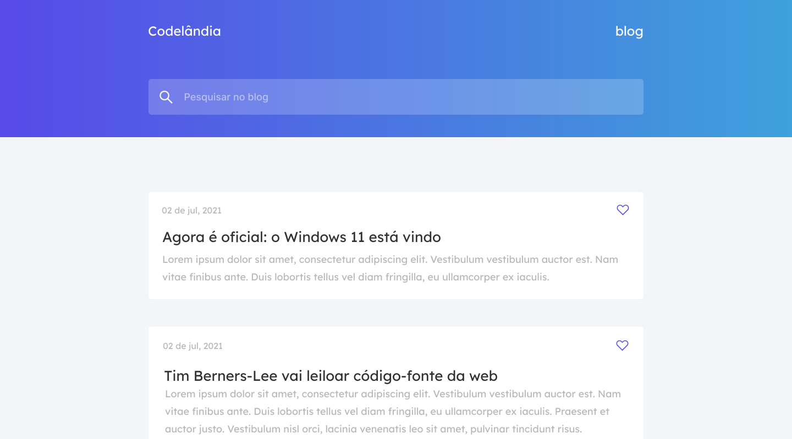

<h1 align="center"> 🏆 Desafio 01</h1>

📰  Pagina inicial de um blog de noticias 

 <a href="#tecnologias">Tecnologias</a> • 
 <a href="#layout">Layout</a> 

 

  

 

## 👉 [Deploy da Aplicação](https://blog-desafio01.netlify.app/)

 

# 🛠 Tecnologias

As seguintes ferramentas foram usadas na construção do projeto:

- [HTML](https://developer.mozilla.org/pt-BR/docs/Web/HTML)
- [Sass](https://sass-lang.com/)
- [JavaScript](https://developer.mozilla.org/pt-BR/docs/Web/JavaScript)

 

# 🔖 Layout

Você pode visualizar o layout do projeto através do link abaixo:

<a href="https://www.figma.com/file/Yb9IBH56g7T1hdIyZ3BMNO/Codel%C3%A2ndia---Desafiosnode-id=0%3A1">Layout Web</a>

