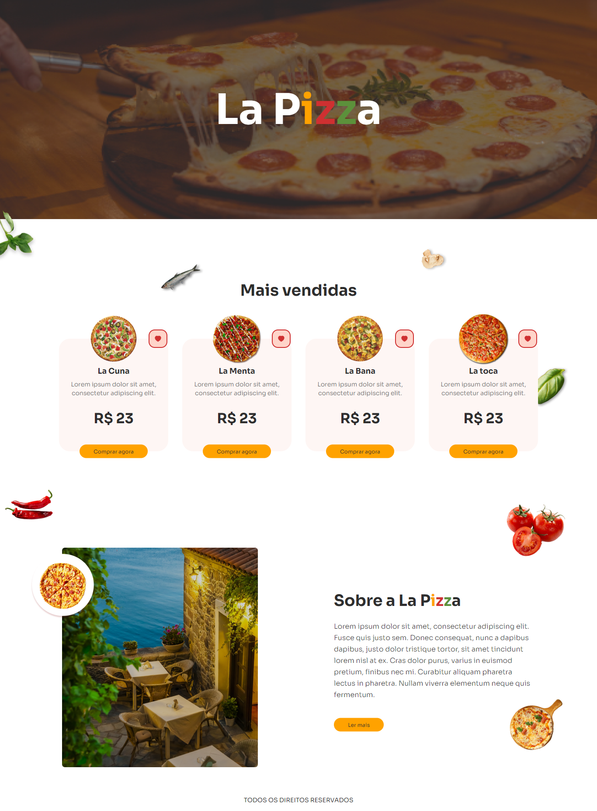

<h1 align="center"> 🏆 Desafio 12</h1>

<h2 align="center">  La Piza</h2>

 <a href="#tecnologias">Tecnologias</a> • 
 <a href="#layout">Layout</a> 

 

  

 

 

# 🛠 Tecnologias

As seguintes ferramentas foram usadas na construção do projeto:

- [HTML](https://developer.mozilla.org/pt-BR/docs/Web/HTML)
- [CSS](https://developer.mozilla.org/pt-BR/docs/Web/CSS)

 

# 🔖 Layout

Você pode visualizar o layout do projeto através do link abaixo:

<a href="https://www.figma.com/file/Yb9IBH56g7T1hdIyZ3BMNO/Desafios---Codel%C3%A2ndia?node-id=11471%3A2">Layout</a>

